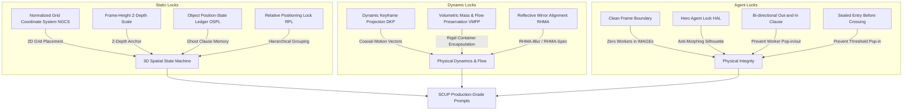

# Spatial Consistency Upgrade Protocol (SCUP)

This protocol addresses the **8 critical spatial consistency vulnerabilities** commonly exposed by AI image and video generation models (such as Veo 3.1, Kling, Runway Gen-3, Sora, etc.) during restoration timelapse prompt execution. It establishes a quantifiable, executable, and rigorous prompt formatting standard to ensure extreme spatial and temporal alignment.

---

## SCUP Architecture



---

## The 8 Solutions & Implementation Rules

### 1. Hierarchical Context Layering & Syntax Pruning (HCL & Syntax Pruning)

* **Principle**: Prevent attention dilution in large-scale diffusion models by **front-loading** the core spatial constraints (Camera DNA + 3 Primary Landmarks) into the **opening** of the prompt — the first ~40 tokens should already be carrying camera and anchors, not scene-setting prose.
* **This is a rule about ORDER, not about total length.** It does not shrink the prompt to 15-20 words and it does not conflict with the word budget in SKILL.md Step 7 (IMAGE 140-180 / VIDEO 260-380). A compliant IMAGE opens with the camera sentence and the locked-anchor sentence, then spends its remaining budget on state delta, traces, lighting, and guardrail. What is banned is burying the camera or the anchors behind a paragraph of description.
* **Syntax Rule**: Replace verbose, comma-separated descriptive text with weight-sensitive punctuation such as colons (`:`) and semicolons (`;`) to act as hard context dividers.
* **Landmark Pruning**: Reduce soft landmarks to exactly **3 high-contrast landmarks** (1 foreground, 1 mid-depth, 1 background) with precise physical and material details.

#### Template Contrast
```diff
- Generate an image of a static tripod shot, ultra-wide 14-18mm lens feel, camera height 1.6m, locked eye-level perspective down a double-height loft. Subject description... many adjectives... left mezzanine edge anchored, right stair run anchored...
+ Generate an image of a static 14mm tripod shot at 1.6m height: [Subject] occupies [Grid B2]. Locked anchors: [Primary Anchor A] at [Grid A1], [Primary Anchor B] at [Grid B3]. [State delta].
```

---

### 2. Normalized Grid Coordinate System & Z-Depth Anchor (NGCS) with RPL

* **Principle**: Replace subjective descriptors ("on the left", "in the background") with absolute coordinate sectors and frame-height percentages.
* **NGCS Grid Matrix (9:16 vertical frame — the pipeline's rendering default)**:
  ```
  +------------+------------+------------+
  | A1 (Top L) | A2 (Top C) | A3 (Top R) |  <-- Background
  +------------+------------+------------+
  | B1 (Mid L) | B2 (Mid C) | B3 (Mid R) |  <-- Mid-Depth
  +------------+------------+------------+
  | C1 (Bot L) | C2 (Bot C) | C3 (Bot R) |  <-- Foreground
  +------------+------------+------------+
        narrow      narrow       narrow
        column      column       column
  ```
  The frame is **taller than it is wide**. Rows are generous depth bands; columns are narrow slices. Separate the 3 primary anchors **up the frame** (one per row), not across it — a lateral spread that works in a horizontal frame pushes the outer anchors off the edge here. Left/right boundary anchors must be features that genuinely sit at the edge of a tall, narrow view (a near wall return, a jamb, a column face), never a distant lateral landmark.
* **Z-Depth Constraint**: Force Z-axis consistency by specifying the Z-depth frame-height scale.
  * *Example*: `The brick column in Grid B2 holds a scale of 60% of the total frame height.` (If this column fluctuates in scale between frames without camera movement, a spatial drift is flagged).
  * *Vertical-frame calibration*: in 9:16 the same real object covers a **smaller** fraction of frame height than horizontal intuition suggests. Default bands: background anchor ≈ one-fifth to one-third, mid-depth anchor ≈ two-fifths to three-fifths, foreground band ≈ one-fifth to one-quarter.
* **Relative Positioning Lock (RPL)**: To prevent T5 encoder "coordinate dilution and cross-contamination" caused by too many absolute grid coordinates, limit absolute `Grid` coordinates to the **3 Primary Anchors**. All other secondary/drift-prone objects must be grouped and anchored using relative positioning tags relative to the 3 Primary Anchors.
  * *Example*: `Relative position locks: green toolbox sits exactly 10cm to the left of the brick column (Primary Anchor B); a rolls of wires lies immediately behind the toolbox.`

---

### 3. Dynamic Keyframe Projection & Optical Flow (DKP)

* **Principle**: Prevent camera drift, perspective rubber-stretching, and geometric distortion during spatial translation (Threshold Bridge or Final Reward) by explicitly defining absolute coordinate projections at $t=0s$, $t=4s$, and $t=8s$.
* **Coaxial Optical Flow Vector**: Establish coordinate boundaries and enforce symmetrical flow vectors radiating from a central optical coordinate.

#### Camera Translation Projection Template
* **First Frame ($t=0s$)**: `At first frame, the door frame opening is centered, occupying Grid B2 (bounding from 0.35 to 0.65 x-axis).`
* **Mid-Frame ($t=4s$)**: `At 4 seconds, the camera enters the opening; door frame edges slide symmetrically outward, exactly crossing Grid B1 and B3 boundaries.`
* **Final Frame ($t=8s$)**: `At final frame, the door frame has fully exited the frame; the shallow interior workbench occupies Grid B2.`
* **Motion Guard**: `coaxial forward push-in vector; all optical flow lines radiate symmetrically from the optical center of Grid B2; the horizon line remains perfectly level at exactly 50% frame height.` (Horizon wording applies to level exterior shots only; for enclosed interiors write `camera pitch locked level; the central vanishing axis stays centered` instead — never mention a horizon or sky indoors. Optical-flow radiation wording belongs only in translation clips, never in static tripod prompts.)

---

### 4. Object Position-State Ledger & Ghost Clause (OSPL)

* **Principle**: Prevent the loss of spatial memory when recurring objects or landmarks are temporarily occluded by scaffolding, machinery, or materials.
* **The Ghost Clause**: When an object is occluded, it must not be omitted from the prompt. It must remain explicitly described within a parenthetical spatial container to lock the latent text encoder parameters.

#### Ghost Clause Syntax
```text
[Object Name] remains physically locked at [Grid Cell] with [original properties], currently fully hidden behind [occluding object].
```
* *Example*: `The original rear window remains physically locked at Grid A2 with broken glass panes, currently fully occluded by the wooden planks of the scaffold; do not relocate or redraw the window.`

---

### 5. Volumetric Mass & Flow Preservation (VMFP) with Rigid Encapsulation

* **Principle**: Enforce physics-based volume preservation for bulk materials (sand, dirt, gravel, plaster debris) to prevent them from magically evaporating or transforming.
* **Percentage Volume Scales**: Define exact volumetric capacities (`100% capacity`, `30% capacity`, `0% cleared`) for bulk materials.
* **Rigid Container Encapsulation (RCE)**: To prevent text-to-video models from animating loose/fluid materials as an "orderless melting/boiling puddle" (granular flicker), all loose materials undergoing transport must be encapsulated inside rigid, quantifiable containers (e.g., buckets, crates, wheelbarrows, bags) with explicit quantities.
  * *Banned*: `workers shovel loose sand from Grid C2` (leads to boiling sand).
  * *Enforced*: `workers shovel sand into three solid dark-green plastic buckets at Grid C2; each bucket holds exactly 15 liters of sand; the buckets are carried to Grid B1.`
* **Physical Transport Path**: Mandate explicit kinetic vectors and transport mechanics for how materials move through coordinates.
* **Volume Conservation (container-to-load scaling)**: Container capacity, trip count, or spoil-pile growth must plausibly account for the volume removed or delivered. Hand buckets and crates cover only sub-half-cubic-metre debris; cubic-metre-scale removals need mechanical containers (excavator buckets, skips, chutes, tracked carriers) or explicitly repeated trips feeding a spoil pile that visibly grows across anchors. Any cut-out slab, panel, or door-sized solid piece gets its own pry-out and carry-out action — crumbs in buckets never account for a large solid piece. A correctly scaled, visibly growing spoil pile satisfies encapsulation for material that stays in frame.

---

### 6. Reflective Mirror Alignment (RHMA) & Reflection Selection (RHMA-Blur / RHMA-Spec)

* **Principle**: Establish absolute geometric reflection locking for high-gloss, epoxy-coated, polished, or wet surfaces, forcing the reflection to match its vertical physical counterpoint.
* **Dual Reflection Modes**:
  * **RHMA-Blur (Highly Preferred Default)**: For general polished, glossy, or wet floors, enforce highly blurred, low-gain diffused reflections. This reduces the video generator's self-attention geometry calculation pressure and successfully eliminates reflective flicker.
    * *Syntax*: `The highly reflective polished [floor material] surface in Grid C1-C3 displays a heavily blurred, low-gloss, diffused reflection of the background; reflections are muted, dark, and highly out-of-focus, preventing high-frequency contrast or sharp details; realistic Fresnel falloff near the margins.`
  * **RHMA-Spec (Specialist Only)**: Use sharp mirror reflection only when the scene explicitly demands perfect mirror-like surfaces (e.g., luxury retail showrooms).
    * *Syntax*: `The mirror-like polished floor surface in Grid C1-C3 displays a geometrically aligned, vertical mirror-image reflection of Grid A1-A3; the reflection perfectly matches the vertical axis, color, and sharp silhouette of the physical counterparts.`

---

### 7. Clean Frame Boundary & Hero Agent Lock (Clean Frame & HAL) with Direct-at-Zero Action

* **Principle**: Eliminate character identity morphing and visual hallucinations by decoupling static state anchors from dynamic action transients.
* **Clean Frame Boundary**: Every `IMAGE 1-(N+1)` anchor must contain **zero active workers or active machinery**. They must serve as sterile, static snapshots of the physical environment.
* **VIDEO-only Active Agents**: Workers, tools, and active machinery exist only in `VIDEO 1-N` prompts. Construction clips begin with the worker already at the active work face and performing effective work from zero seconds through the final frame.
* **Persistent Site Plant Exception**: long-duration temporary works (scaffolding, formwork, shoring, cribbing, site cranes) are NOT transients — Clean Frame bans active workers and running machinery, not parked plant. They arrive in a named erection beat, persist across later IMAGE anchors as static unmanned equipment tracked in the object ledger, and leave only through a named temporary-works-strike beat with visible strike traces. Fresh unset concrete must always be shown supported by its formwork.
* **Direct-at-Zero Worker Clause**: Every ordinary construction VIDEO starts at $t=0s$ with the worker already positioned at the active work face and making the first effective tool contact immediately. Never show or describe arrival, entrance, exit, walk-out, or a worker-free tail inside that clip.
  * *Syntax*: `At t=0s, the lone worker is already positioned at the active work face and makes the first effective tool contact immediately, then repeats the visible operation continuously through the final frame without entrance or exit choreography.`
* **Hero Agent Lock (HAL)**: When a worker must remain in frame during a video clip, lock their silhouette using low-detail, high-contrast block properties.
  * *Banned*: Facials, clothing patterns, logos, brand names.
  * *Enforced*: `one lone worker in a solid bright-neon-yellow safety vest, a white hardhat, and solid dark blue work pants; the worker remains in a static crouched pose in Grid C2, repeating one single arm-troweling motion; do not show the worker's face.`

---

### 8. Sealed Entry with Anchor Inheritance (replaces the pre-bridge sneak-peek)

* **Principle**: Prevent threshold-crossing videos from "exploding" or generating hallucinated interior layouts by giving the video model nothing to reconcile at the start of the crossing. The earlier rule did the opposite — it required a peek through an open doorway — and live runs showed that peek is where the instability comes from: it is a low-resolution, largely invented patch of interior that the model then treats as a fact it must match while interpolating, and when it cannot, the space the camera lands in reads as a different world (or the camera never fully gets inside).
* **Sealed Entry (mandatory)**: The exterior `IMAGE T` immediately preceding the crossing clip must show its entry **CLOSED** — a shut door or hatch, or, on a carrier whose entrance has no leaf built yet, unlit darkness filling the raw opening. It must show NOTHING of the interior: no peek, no interior landmark visible beyond it, no lit depth. This applies to every crossing variant.
* **Anchor Inheritance (mandatory)**: The interior primary anchors are registered up front (in the packet) and the crossing lands on exactly that set — they are never swapped for a fresh set invented at the settle. They are first *seen* inside the crossing clip, which opens the entry on camera.
* **Anchor Qualification (mandatory)**: Registered interior anchors must plausibly already exist at crossing time — original structure, natural formations, pre-existing wreckage, or items installed in an earlier on-camera beat. Future construction products (uncarved stairs, unplaced furniture, uninstalled fixtures) are banned: the crossing precedes interior construction, so landing on them forces objects to exist before the beat that creates them.
* **Scale declaration**: each interior anchor's frame-height scale is declared once, at `IMAGE T+1`, where it settles. `IMAGE T` declares no interior scale, because it shows no interior.
* **Continuous Trajectory**: Inside the clip, once the entry is open, the registered landmarks scale up symmetrically during camera translation, never repositioning or re-rendering.
  * *IMAGE T Syntax*: `The plank entry door in Grid B2 is closed tight in its frame, boards swollen and streaked with rust from the strap hinges; nothing of the space behind it is visible.`
  * *VIDEO T Syntax*: `The closed door swings inward on camera, revealing the dark interior for the first time; the camera pushes forward through the opening and the brushed-steel tool cabinet and red fire extinguisher come into view and scale up continuously along the camera axis, never repositioning, never re-rendering.`
  * *Interior IMAGE Syntax (post-crossing)*: `Interior primary anchors: the brushed-steel tool cabinet locked at Grid B3; the red fire extinguisher locked at Grid A3.`
* **Full crossing protocol**: When the camera physically travels from exterior to interior, the entire beat must follow the **Threshold Bridge Consistency Protocol (TBCP v4)** — see `threshold-bridge-consistency-protocol.md`. TBCP composes the crossing as exactly ONE merged beat (one meta-tagged clip between `IMAGE T` and `IMAGE T+1`; the earlier two-clip split with a shared handoff frame was retired in v4), locks a single-variable bridge camera, soft-rolls exposure/white-balance, and wipes the cut behind the moving door frame.
---

### 9. Natural-Language Visual-Only Translation Rule (NLVTR)

* **Principle**: Prevent image/video generation models from interpreting structured/labeled prompt content (like colons, math percentages, or dry acronyms) as instructions to render graphic text overlays on the screen.
* **Rules**:
  * **No raw percentages**: Do not use `%` characters in final prompts (e.g. `10% to 90%`). Use qualitative descriptive language (e.g. "from a small corner area to occupying nearly the entire floor from the margins inward").
  * **No mathematical/numeric capacity scales**: Rephrase capacity metrics (e.g. `100% capacity to 0% cleared`) into visual observations of materials and containers (e.g. "a bucket filled to its rim with rocks is gradually emptied, exposing its dry dark plastic bottom").
  * **No colons inside variables**: Eliminate colons inside descriptions (e.g. replace `progress marker 1: swept clean area ratio increases` with a fluid sentence).
  * **No SCUP acronyms**: The acronyms `TSPA`, `HAL`, `VMFP`, `GCTR`, `RPL`, `RCE`, `SCUP`, `NGCS`, `OSPL`, `RHMA`, `PBISP`, `HCL`, `NLVTR`, and `MTAL` are for internal design and checking only — this is the pipeline's complete hard-enforced ban list; they must be completely scrubbed from the final copy-ready prompts (including the word `SCUP` itself).

---

### 10. Beat Overload & Pop Prevention

* **Principle**: Ensure temporal smoothness by enforcing that adjacent IMAGE anchors have minor, gradual state deltas that can be interpolated in 8 seconds without sudden visual snaps.
* **Rules**:
  * **At most 1 major operation per beat**: A single video clip can only depict a single continuous physical process (e.g. debris removal, plywood subflooring, wall insulation, painting, lighting, or furnishing). Forbid combining structural framing, wall insulation, and ceiling paneling into one beat.
  * **Full coverage per milestone package (Global Stage Delta)**: the named terminal product must reach its FULL visible extent/count — a paneling milestone covers every declared wall and ceiling surface, while a roof-closeout milestone may combine its panels, door, and threshold finish when they occupy the same zone and jointly define the completed shell. Anti-popping comes from one coherent result, repeated action cycles, and continuous dual progress, NOT from shrinking the changed area. Token patches and unrelated cross-phase bundles are forbidden; adjacent IMAGE anchors must differ so strongly that a side-by-side viewer instantly sees a completed stage.

### 11. Human-Spatial Metric Conservation & Ergonomic Scale Lock (HSMC)

* **Principle**: Prevent subterranean dugouts, tree cavities, and compact shelters from expanding into giant cavernous halls by binding all camera framing, spatial envelopes, prop inventories, and worker scales to explicit metric dimensions.
* **Strict Metric 3D Envelopes**:
  * Every enclosed carrier space MUST declare explicit 3D metric dimensions: e.g. `compact circular subterranean room: diameter 3.0 meters, ceiling clearance 2.2 meters`.
  * Exterior excavation pits MUST declare diameter and depth in meters (e.g. `compact circular excavation pit: diameter 3.2 meters, depth 1.8 meters`).
* **Ergonomic Prop Allocation (Banned Oversized Props)**:
  * For compact structures (diameter/span $\le 3.5\text{m}$), **FORBID** residential-scale massive furniture (e.g. `two-tier bunk bed / double bunk bed`, large sectional sofas, formal dining tables).
  * **ENFORCE** compact ergonomic fixtures: `low-profile single timber platform daybed` (height 0.4m, length 2.0m), `recessed wall berth/nook`, `compact 80cm-high timber workbench`.
* **Standard Camera & Horizon Normalization**:
  * Normalize all main shots to `24mm wide-angle lens feel (natural perspective without extreme fisheye distortion)` at `camera height 1.3m (human chest level)`.
  * Horizon line / vanishing line locked at `45% to 50% frame height`.
* **Video Scale Figure Lock**:
  * In dynamic video prompts, declare worker scale: `a lone male worker (1.78m tall, occupying ~35% of frame height, realistically proportioned to the 2.2m ceiling)`.
* **Negative Scale Restraints**:
  * Mandatory negative terms: `(cavernous hall, oversized room, giant space, miniature furniture, dollhouse scale, telephoto distortion:1.4)`.

---

## SCUP Standard Quality Audit Table

Every prompt set must be evaluated against this quality matrix. A single `FAIL` triggers a prompt rewrite before final delivery.

| SCUP Metric | Audit Checklist Item | Focus Area & Drift Risks |
|---|---|---|
| **NGCS & RPL Grid Check** | Are 3 Primary Landmarks anchored using `Grid A1-C3` and Z-depth scales? Are secondary/drift-prone objects locked relatively using Relative Positioning Lock (RPL)? | Eliminates coordinate dilution, prevents spatial/depth drift and coordinate mix-ups in T5 encoder. |
| **DKP Trajectory** | Do camera translation prompts feature coordinates for $t=0s, 4s, 8s$ and optical flow? | Mitigates visual warping and perspective stretching. |
| **OSPL Persistent** | Are occluded landmarks/ledger objects retained using the `Ghost Clause`? | Retains memory of background layout behind scaffolds. |
| **VMFP & RCE Volume** | Do bulk materials have volume percentage capacities? Are loose materials encapsulated in rigid, countable containers (buckets/bags) with explicit kinetic paths? Does container scale / trip count / spoil-pile growth plausibly match the removed volume, and does every cut-out solid piece get a carry-out action? | Prevents materials from instantly melting or evaporating; blocks granular flicker, puddling, and rubble-vaporisation volume breaks. |
| **RHMA Reflection** | Is the reflection alignment clause present for polished/wet surfaces? Does it default to highly blurred/diffused reflection (RHMA-Blur) to prevent flicker? | Matches reflection geometry with background physical objects; eliminates high-frequency reflective flicker. |
| **Clean Frame** | Are all static `IMAGE` prompts completely empty of workers and active machinery? | Prevents worker identity morphing and ghost artifacts. |
| **Direct-at-Zero Worker Action** | Do construction video prompts place workers at the active work face at $t=0s$ with immediate effective action and no entrance/exit choreography? | Uses the entire clip for visible construction progress. |
| **HAL Silhouettes** | Are workers locked using high-contrast solid silhouettes and silhouette poses? | Blocks morphing of clothing patterns, facial details, or poses. |
| **Sealed Entry**| Is the entry CLOSED and opaque in the pre-crossing IMAGE, with nothing of the interior visible, and does the crossing clip open it on camera? Does the crossing land on exactly the registered interior primary anchors (Anchor Inheritance), all plausibly pre-existing at crossing time (never future construction products)? | Eliminates random layout explosion, anchor amnesia, causality inversion, and the interpolation failure caused by asking the video model to match a hallucinated peek. |
| **TBCP Threshold Bridge (v4)** | For any exterior→interior crossing: is it exactly ONE merged beat — one meta-tagged crossing VIDEO between `IMAGE T` and `IMAGE T+1`, never a two-clip split with a sill-handoff frame — with a single-variable bridge camera, a soft exposure/WB roll attributed to door-shade + doorway backlight, a symmetric door-frame wipe, ≥1 cross-threshold material/light tether, a sealed entry in `IMAGE T` that the clip opens on camera, the registered interior anchors carrying their settled scales in `IMAGE T+1`, and no construction work inside the clip? | Eliminates the three-system simultaneous flip (lighting + camera family + anchor set) that causes interior explosion; see TBCP reference. |
| **NLVTR Text Lock** | Are raw percentages (`%`), numeric ranges, colons in variable strings, and SCUP acronyms (`TSPA`, `HAL`, `VMFP`, `GCTR`, `RPL`, `RCE`, `SCUP`, `NGCS`, `OSPL`, `RHMA`, `PBISP`, `HCL`, `NLVTR`, `MTAL`, `HSMC`) completely banned and removed from final prompts? | Eliminates text watermark overlays and mathematical artifacts on the generated video. |
| **Visible Milestone Package Lock** | Does every ordinary video beat create exactly one named terminal stage product at its FULL visible extent/count, using one operation or at most three tightly related same-zone actions, with both primary-product and secondary-material progress lines (never a token patch or cross-phase bundle)? | Keeps adjacent anchors instantly distinguishable while allowing physically coherent reference-case closeout packages. |
| **HSMC Metric & Human Scale Lock** | Are spatial dimensions declared in metric terms (e.g. 3.0m diameter, 2.2m clearance)? Are oversized residential props (bunk beds) banned in compact carriers and replaced with platform daybeds? Is worker height anchored at ~1.78m (~35% frame height)? Are negative anti-cavernous terms applied? | Prevents compact dugouts from expanding into giant cavernous halls and eliminates miniature/giant human scale distortion. |

