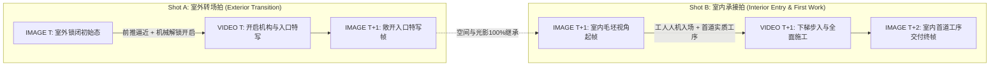

# Threshold Bridge Consistency Protocol (TBCP v5)
## Two-Shot Decoupled Transition Architecture (双镜头解耦过门全局体系)

This protocol governs the single most failure-prone transition in any restoration timelapse: the **exterior → interior crossing** (the "threshold bridge"). 

> **彻底废除老单镜头直推法 (Full Deprecation of Single-Push Pass-Through)**:
> 历史版本中的“单镜头直推穿门（Single Merged Coaxial Push-Through）”已全面废除。老方法试图在单个视频片段内完成从室外逼近、穿透门框、曝光剧变到室内落地的全过程，极易引发 AI 空间拉伸形变（Rubber-stretch morphing）、门框撕裂、曝光与白平衡瞬间翻车、以及过门与室内施工混杂污染。
> 
> **TBCP v5 统一核心架构：双镜头解耦转场 (Two-Shot Decoupled Transition Architecture)**
> 所有从室外到室内（或主空间进入密闭新空间）的物理跨越，必须**全局统一解耦为两个前后紧密咬合的独立节拍（Shot A 室外转场拍 + Shot B 室内承接拍）**。

---

## TBCP v5 核心双镜头架构

---

## The Rules (核心实施准则)

### 1. 镜头 A：室外转场拍 · 物理开启与入口特写 (Shot A: Exterior Mechanical Opening & Portal Push-in)

- **定位与使命**：承担空间由闭到开的机械动作、悬念建立与空间连通性交代。
- **构图与机位**：
  - 室外中近景 $\rightarrow$ 特写推进（Push-in forward tracking shot，24mm 广角镜头，初始机高 1.5m 滑动至 1.2m，微俯 15°~30° 对准入口/阀门/舱盖）。
- **显式物理开启机制 (Mandatory Mechanical Opening Action)**：
  - 必须明确描写机械解锁与物理开启过程：
    - 潜艇/地下掩体：旋转潜艇式重型金属手轮/密封阀门、气动减压、向上掀起厚重金属舱盖。
    - 木屋/遗迹：拔掉安全插销、拉开厚重实木门栓、向内推开原木门扇。
    - 集装箱/工业车厢：转动重型锁紧手柄、液压撑杆顶升顶舱盖、滑轨侧移开启金属闸门。
- **终帧 (Image T+1 入口特写)**：
  - 特写敞开的门洞/舱口（Portal Framing），清晰呈现门框、密封橡胶垫圈、法兰螺栓、铰链以及通向内部的通道上部结构（如垂直金属爬梯顶部、第一级台阶）。
  - 室外天光自然倾泻入通道内部，深处保持原始毛坯状态。
- **零内部施工污染原则 (Zero Work Contamination)**：
  - Shot A 内部全程无工人施工、无内部工具、无材料堆积，纯粹展现开启与通道连通。
- **音效设计 (Diegetic ASMR 60%)**：
  - 金属阀门齿轮卡扣旋转喀哒声、气压密封减压泄气嘶嘶声、重型金属/木质铰链开启摩擦声、敞开轴孔回声。

---

### 2. 镜头 B：室内承接拍 · 工人人机入场与首道工序 (Shot B: Interior Entry, Staging & First Physical Work)

- **定位与使命**：承担室内视角的建立、人物/工人真实入画走位、以及室内第一道实质性物理工序的交付。
- **构图与机位**：
  - 室内全景固定三脚架机位（24mm 广角，1.3m 视高，水平视角，严禁鱼眼或广角畸变），正对室内主景深轴线（如远端观景窗或主后墙），入口/爬梯位于画幅侧方（如 Grid B1/B3）。
- **起帧继承 (Image T+1 室内视角)**：
  - 100% 物理继承 Shot A 的敞开状态（上方或侧方入口处有自然天光倾泻）。
  - 空间呈现原始未动工的毛坯废墟状态（Raw shell: 未涂装氧化钢板/粗糙水泥/裸露石壁、地表面浮尘）。
- **物理入场与施工动作 (Entry + Tool Action)**：
  - **工人真实入画**：工人（1.78m 高，身着反光背心与安全帽，占画面高度约 35%）顺着金属爬梯下行踩上地面，或迈过门槛步入室内。
  - **首道工序立即展开**：工人拉入第一道工序所需工具设备（如高压无气喷枪、清渣铁铲、龙骨水平尺），立即展开并全域交付室内第一道实质性物理工序（如喷涂防腐底漆、清理地面积尘废渣、铺设基础龙骨）。
- **终帧 (Image T+2 交付成果)**：
  - 室内全域清晰呈现第一道物理工序交付完成的平整状态，为后续木工/地台/软装工序建立物理基底。
- **音效设计 (Diegetic ASMR 60%)**：
  - 工人重型工作靴踏击钢梯/踩地闷响、空压机运转轰鸣、高压喷枪脉冲喷射声或铁铲清渣碰撞声。

---

### 3. 空间三维公制包络与防膨胀约束 (Metric Envelopes & Anti-Cavernous Protocol)

- **公制三维包络硬声明 (Strict Metric Envelope)**：
  - 室内空间必须显式声明公制三维尺寸参数（如集装箱密室 `strict 2.4m internal width, 6.0m depth, 2.2m ceiling clearance`；地穴密室 `diameter 3.0m, strict 2.2m ceiling clearance`）。
  - 严禁在提示词中使用模糊或无量纲修饰词（如 `spacious`, `small room`），严防 AI 空间拉伸膨胀。
- **固定物理结构锚点 (Fixed-Feature Anchor Lock)**：
  - 室内必须锁定至少一个固定建筑结构特征（如观察窗框、瓦楞钢肋、顶部横梁、原有石壁），严禁仅依赖可移动道具（如灭火器、工具箱）作为锚点。
- **负向防膨胀词库 (Negative Scale Restraints)**：
  - `(cavernous hall, oversized room, giant space, miniature furniture, dollhouse scale, telephoto distortion:1.4)`。

---

### 4. 过门时空单调继承与零状态回退 (Monotonic Chronological Inheritance)

- **室外施工产物 100% 物理继承**：
  - 室内首帧与所有后续室内帧必须 100% 继承室外阶段已完成的所有施工产物（如屋顶梁板、防水卷材、门槛铺设、已清扫泥地等）。
  - 严禁在室内首帧中描写已被室外工序修复的破损（如天花板漏水、开裂或地面重复堆积落叶等状态倒退词）。

---

## TBCP v5 审计检查表 (Audit Table)

| 审计指标 | 检查项目 | 消除的失真风险 |
| :--- | :--- | :--- |
| **双镜头解耦架构** | 是否严格拆分为 Shot A（室外开启特写）+ Shot B（室内下梯与首道工序）两个独立节拍？ | 彻底消除老单镜头穿门导致的门框撕裂、空间畸变与人机混杂 |
| **显式物理开启机制** | Shot A 是否明确描写具体机械解锁动作（转动阀门手轮、拉开门栓、撑开气压杆）？ | 避免门扇瞬移凭空消失或无动机开启 |
| **入口特写终帧** | Shot A 终帧是否特写敞开的门洞/舱口并露出内部首段爬梯/台阶？ | 建立空间连通性与景深透视悬念 |
| **Shot A 零施工污染** | Shot A 内部是否完全没有工人施工、无内部工具材料堆积？ | 保证镜头纯净性与工序逻辑单调性 |
| **真实工人入画与走位** | Shot B 是否真实描写工人爬下梯子/步入室内踏上地面的动作？ | 避免人物瞬移凭空出现在室内工区 |
| **首道工序无缝承接** | Shot B 是否在工人着地后立即启动室内第一道实质性物理工序（喷漆/清渣/打底）？ | 确保 1:1 节拍映射与时间线高效推进 |
| **公制三维包络** | 室内提示词是否显式声明宽、深、高公制尺寸（如 2.4m x 6.0m x 2.2m）？ | 彻底杜绝紧凑型空间膨胀为巨大礼堂 |
| **ASMR 音效三位一体** | 是否包含手轮转动、气阀泄压、梯级踩踏、喷枪脉冲等真实原声？ | 保证 ASMR 60% 物理沉浸感，严禁声画脱节 |
